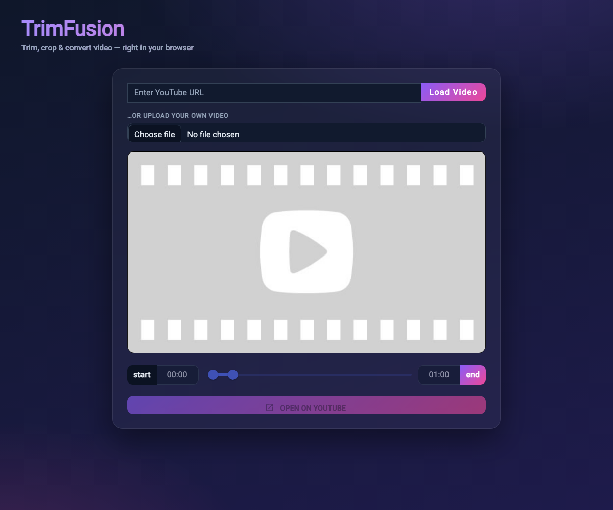

# TrimFusion

**🔗 Live demo: https://damika-s-play-ground.github.io/TrimFusion/**

TrimFusion is a fast, privacy-friendly video trimmer that runs **entirely in your
browser** — no uploads, no backend. Trim a clip, crop it to a display size, export it as
video/audio/GIF, or grab a still frame. You can also paste a YouTube link to preview and
mark start/end times.



> **Everything runs client-side.** Uploaded videos never leave your device — trimming and
> conversion are done in-browser with [ffmpeg.wasm](https://github.com/ffmpegwasm/ffmpeg.wasm).

## Features

- **Trim your own video** — upload a local file and cut it to a start/end range with a
  dual-handle slider and HH:MM:SS labels. Fast, lossless stream copy by default.
- **Crop to display sizes** — export at **16:9** (landscape), **9:16** (Shorts/Reels),
  **1:1** (square), **4:5** (portrait), or keep the original.
- **Export options** — download as **Video (MP4)**, **Audio only (MP3)**, or **animated
  GIF**.
- **Grab a still frame** — save the current frame as a **PNG** in one click.
- **YouTube preview** — paste any YouTube URL (`youtu.be`, `/shorts`, `/embed`,
  `watch?v=`, …); the embedded player honors your start/end range.
- **Runs everywhere** — pure static site, deployed to GitHub Pages.

## Tech stack

Angular 16 · Angular Material · TypeScript · [ffmpeg.wasm](https://github.com/ffmpegwasm/ffmpeg.wasm)
(single-threaded core, loaded on demand from a CDN) · GitHub Actions CI + Pages deploy ·
Prettier · Karma/Jasmine unit tests.

## Getting started

```bash
git clone https://github.com/Damika-s-Play-Ground/TrimFusion.git
cd TrimFusion
npm install
npm start          # dev server at http://localhost:4200
```

Other scripts:

```bash
npm run build      # production build to dist/trim-fusion
npm run test:ci    # headless unit tests
npm run format     # Prettier
```

## Usage

1. **Upload a video** (or paste a YouTube URL to preview).
2. Drag the slider handles to set the **start** and **end** of your clip.
3. Optionally pick an **Export as** format and a **Crop to display size**.
4. Click **Trim & Download** — the clip is produced in your browser and downloaded.
   Or click **Grab current frame** to save a PNG of the current frame.

> Note: the YouTube path is **preview-only** — YouTube doesn't allow client-side download
> of its videos, so the button there opens the source on YouTube. Real trimming/export
> works on **uploaded** files.

## Contributing

Contributions are welcome — open an issue or PR.

## License

MIT — see [LICENSE](./LICENSE).

## Contact

Questions or feedback? Reach out at damikaanupama@gmail.com.

---

Made with ❤️ by [Damika Anupama](https://www.linkedin.com/in/damika-anupama-62a22a19a/)
